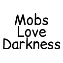

# Mobs Love Darkness



A Fabric mod for Minecraft 1.20.1, 1.21.1 and 1.21.11 that gives certain mobs a chance to fixate on and destroy nearby light sources, creating dangerous dark zones and rewarding players who pay attention.

## What it does

Some mobs will occasionally lock onto nearby torches, lanterns, and campfires and attempt to destroy them. A fixated mob glows and emits soul fire particles, giving an observant player a chance to react before their lighting is gone. Once the mob reaches the light source it breaks it, playing a distinctive sound and returning to normal behavior in the newly created darkness.

Phantoms may occasionally destroy exposed torches during their swooping attacks, making open-air lighting somewhat vulnerable at night — but their erratic flight means covered lighting remains relatively safe.

Everything is highly configurable.

## Features

- Configurable list of eligible mob types — any mob can be added via config
- Configurable list of targetable blocks — works with any block ID including modded blocks
- Per-mob-type goal assignment chance — phantoms can be tuned separately from high-spawn mobs like zombies
- Optional glowing effect on fixated mobs for player readability
- Optional soul fire particle trail while fixating
- Optional distinctive sounds on fixation start and light source destruction
- Unreachable targets are blacklisted per-mob to prevent stuck behavior
- Block protection mod compatible — protected blocks are detected and blacklisted gracefully
- All behavior is server-side only, no client installation required for multiplayer

## Default behavior

By default, the following mobs are eligible for the light fixation goal:

| Mob | Default eligibility chance |
|---|---|
| Zombie | 5% |
| Husk | 5% |
| Zombie Villager | 5% |
| Zombified Piglin | 5% |
| Phantom | 75% |

The following blocks are targeted by default:

- Torch / Wall Torch
- Lantern
- Soul Torch / Soul Lantern
- Campfire / Soul Campfire

## Configuration

The config file is generated at `config/mobs-love-darkness.json5` on first launch. All fields include descriptions and valid ranges directly in the file.

| Config | Default | Description |
|---|---|---|
| `LightSourceSearchRadius` | 16 | Block radius to search for light sources. Range: 1–128 |
| `LightSourceSearchRadiusVertical` | 4 | Vertical block radius to search for light sources. Range: 1–128 |
| `LightSourceBreakTimeTicks` | 20 | Ticks to break a light source (20 ticks = 1 second). Range: 1–1200 |
| `LightFixationChance` | 0.05 | Chance per second that an eligible mob fixates on a nearby light source. Range: 0.0–1.0 |
| `LightFixationSpeedMultiplier` | 0.85 | Movement speed multiplier while fixating (1.0 = normal speed). Range: 0.1–10.0 |
| `LightFixationCooldownTicks` | 200 | Ticks before a mob can fixate again after destroying a light source. Range: 0–72000 |
| `LightFixationMaxGoalTicks` | 600 | Maximum ticks spent on a single fixation attempt before giving up. Range: 100–72000 |
| `LightFixationGoalPriority` | 3 | Goal priority (lower = higher priority, vanilla zombie attack = 2). Range: 1–10 |
| `EnableParticles` | true | Soul fire particle trail on fixated mobs |
| `EnableSounds` | true | Sounds on fixation start and light source destruction |
| `EnableLightFixationGlowEffect` | true | Glowing outline on fixated mobs |
| `TargetableLightSources` | see above | List of block IDs to target, including modded blocks |
| `LightFixationEligibilityChancePerMobType` | see above | Per-mob-type chance to receive the goal on spawn |

## Performance guidance

Search cost scales cubically with radius — a radius of 128 checks ~500x more 
blocks than a radius of 16. Balance search radius against mob eligibility:

| Search radius | Recommended max eligible mobs |
|---|---|
| 16 (default) | ~50 |
| 32 | ~20 |
| 64 | ~5 |
| 128 | ~1-2 |

`LightSourceSearchRadiusVertical` (default: 4) also contributes to search cost. 
Increasing it significantly will reduce performance — keep it low unless your 
use case specifically requires searching underground.

These are rough guidelines. Actual impact depends on hardware and other mods.

### Adding modded mobs and blocks

Any valid block or entity registry ID works in the config lists:

```json
"LightFixationEligibilityChancePerMobType": {
    "minecraft:zombie": 0.05,
    "minecraft:phantom": 0.75,
    "alexsmobs:warped_mosco": 0.10
},
"TargetableLightSources": [
    "minecraft:torch",
    "minecraft:wall_torch",
    "supplementaries:oil_lamp"
]
```

## Compatibility

**Game rules**
- This mod respects the mobGriefing game rule. If mobGriefing is disabled when a mob spawns, it will not receive the light fixation goal. Mobs that already have the goal when mobGriefing is disabled will stand down gracefully without breaking blocks.

**Works with:**
- Sodium, Iris, Lithium, and other performance mods
- Mods that add new mob types — add them via config
- Mods that add new light source blocks — add them via config

**Does not affect:**
- Client-side dynamic lights from shader mods — only actual world blocks are targeted
- Bedrock Edition — Java only

**Potential conflicts:**
- Mods that completely replace mob AI goal selectors may prevent the goal from being injected
- If goal priority conflicts with another mod, adjust `LightFixationGoalPriority` in config (vanilla zombie attack goal is priority 2)

**Block protection mods (GriefPrevention, FTB Chunks, etc.)**
— protected blocks are detected after a break attempt and blacklisted, preventing repeated attempts. Note: FTB Chunks mob griefing protection on Fabric only covers Endermen by default and will not prevent this mod's block breaking — use the mobGriefing game rule for global protection instead.

## Known limitations

- There is no distinction between player-placed and world-generated blocks — blocks that are naturally generated can also be targeted
- Phantoms have imprecise torch-targeting due to their flight navigation — this is somewhat by design, as accurate phantom targeting would be difficult to counter
- Disabling the mobGriefing game rule prevents new mobs from receiving the goal and prevents blocks from being broken by mobs that already have it

## Building from source

```bash
git clone https://github.com/AndartaMC/mobs-love-darkness.git
cd mobs-love-darkness
./gradlew build
```

The built jar will be in `build/libs/`.

## License

[MIT](LICENSE) — feel free to include this mod in modpacks.
